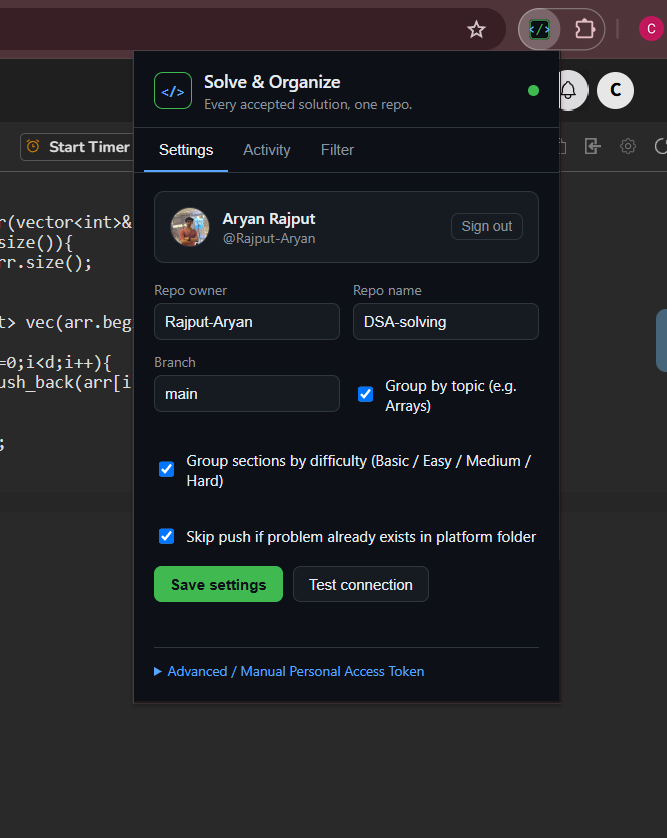
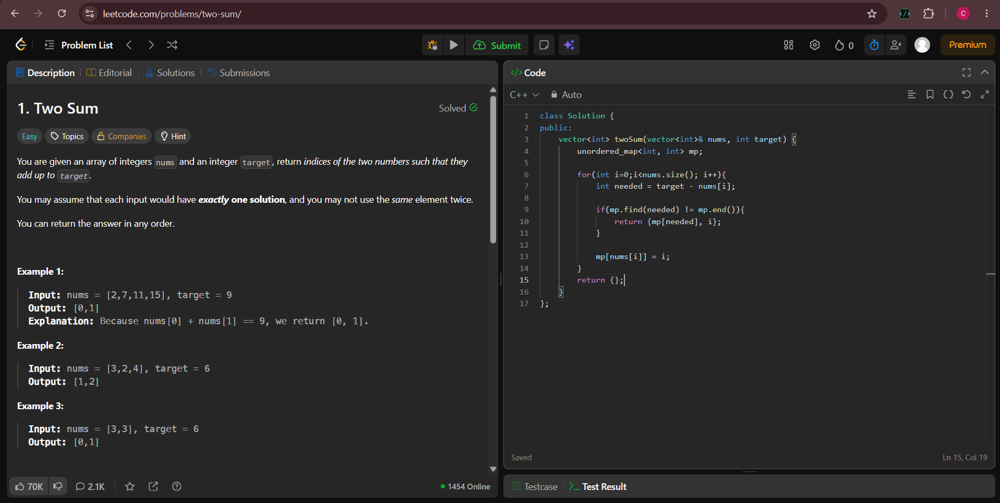
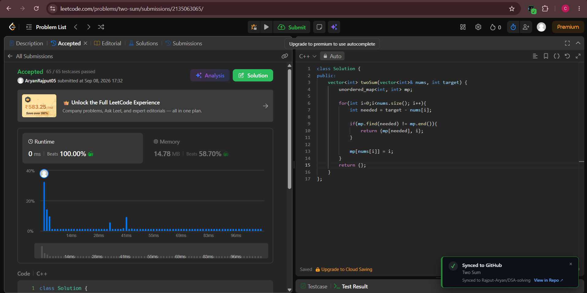
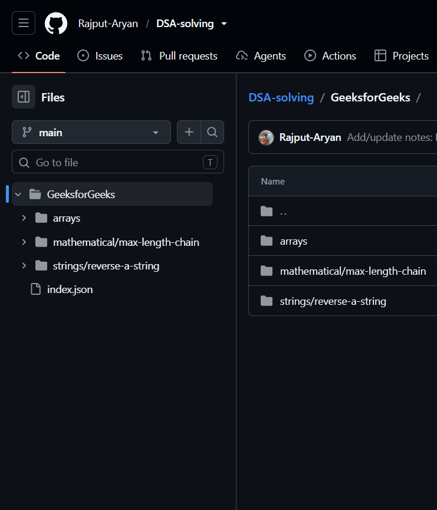
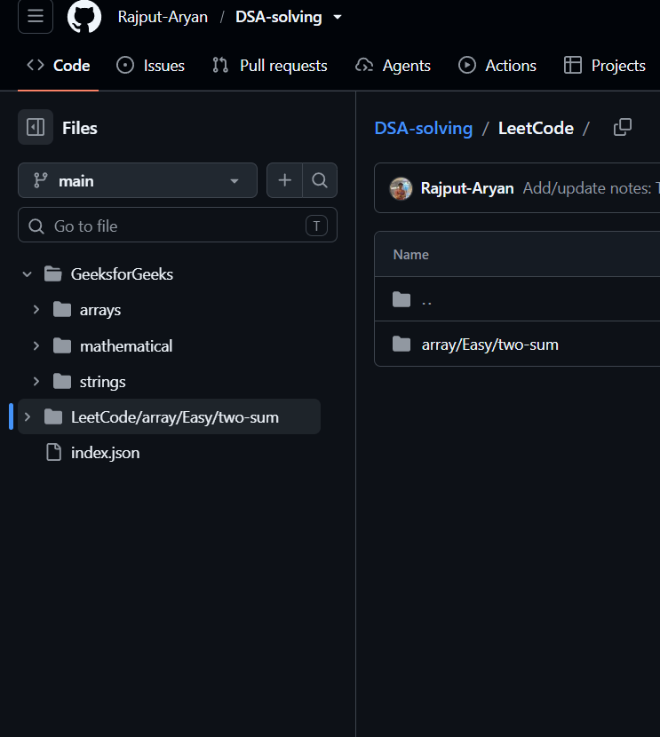
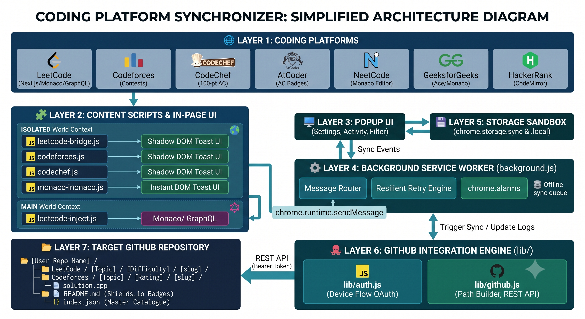

# 🧩 Solve & Organize

**Solve a problem. Never manually organize it again.**

Solve & Organize is a Chrome extension that watches you solve problems on LeetCode, Codeforces, CodeChef, AtCoder, NeetCode, GeeksforGeeks, and HackerRank — and the moment you get an "Accepted" verdict, it automatically pushes your solution, a clean write-up, and metadata straight into a GitHub repository of your choice. No copy-pasting. No manual commits. No half-finished "I'll organize this later" folder.



---

## 😩 The Problem

If you grind problems across multiple platforms, you already know the routine: solve it, then — *maybe* — remember to copy the code into a local folder, rename the file, figure out which topic bucket it belongs in, write a mini explanation, and push it to GitHub. Most people do this for the first 10 problems and then quietly stop. The result is a GitHub profile with no real trace of the hundreds of problems actually solved.

## ✅ The Fix

Solve & Organize removes every one of those manual steps. It detects the "Accepted" verdict directly from the platform (via API interception or DOM observation, depending on the site), grabs your actual solution code, and pushes a fully organized commit to your repo — automatically.

```
[Platform] / [Topic] / [Difficulty] / [problem-slug] /
  ├── solution.[py | cpp | java | js | go | rs | ...]
  └── README.md
```

A root-level `index.json` catalogue is kept in sync with every push, so the repo itself becomes a queryable, filterable archive of everything you've solved.

**Before → After:**

| Before | After |
|---|---|
|  |  |

| Repo before sync | Repo after sync |
|---|---|
|  |  |

---

## ✨ Features

- **7 platforms supported** — LeetCode, Codeforces, CodeChef, AtCoder, NeetCode, GeeksforGeeks, and HackerRank, each with a purpose-built detector for that site's verdict/UI pattern.
- **Secure GitHub connection** — connect seamlessly with a GitHub Personal Access Token (PAT) with `repo` scope. No backend servers, no third-party databases.
- **Automatic organization** — every solution lands in a consistent `Platform / Topic / Difficulty / slug` folder structure, with the source file and a generated `README.md` per problem.
- **Rich, auto-generated write-ups** — each problem README includes badges, a metadata table, the problem statement, examples/constraints, and a complexity-notes section.
- **Duplicate-safe** — a 3-level check (index.json → repo tree → direct path) means re-solving a problem never creates junk commits.
- **Works offline** — if GitHub is unreachable, the submission is queued locally and retried automatically once you're back online.
- **In-page confirmation** — a lightweight toast notification (rendered in an isolated Shadow DOM so it can't be broken by the host page) confirms every sync, with a direct link to the new file.
- **Filterable popup** — browse your synced solutions by topic or difficulty right from the extension popup, without leaving the coding site.
- **Live activity log** — see your last 50 pushes, including skipped duplicates and pending retries.

---

## 🏗️ How It Works



1. You solve a problem and hit submit.
2. A content script on that platform detects the "Accepted" verdict and extracts your source code, along with the title, difficulty, topics, and problem statement.
3. That payload is relayed to the extension's background service worker.
4. The service worker checks your settings, confirms the problem isn't already in the repo, and pushes the solution file, a generated README, and an updated `index.json` to GitHub via the REST API.
5. You get an in-page toast confirming the sync, with a link straight to the new file.

Everything happens client-side and talks directly to `api.github.com` — there's no intermediary server, and your code and credentials never pass through anything but your browser and GitHub.

---

## 🚀 Getting Started

### 1. Install the extension

```bash
git clone https://github.com/Rajput-Aryan/solve-and-organize.git
cd solve-and-organize
```

Then in Chrome:

1. Go to `chrome://extensions`
2. Enable **Developer mode** (top-right toggle)
3. Click **Load unpacked** and select the project folder

### 2. Connect your GitHub account (Personal Access Token)

1. Open [GitHub Personal Access Tokens (classic)](https://github.com/settings/tokens) (or click **Generate Token ↗** in the extension popup).
2. Click **Generate new token (classic)**:
   - **Note:** `Solve & Organize Extension`
   - **Expiration:** Set according to your preference (e.g., 90 days or No expiration)
   - **Scopes:** Check the **`repo`** checkbox (Full control of private and public repositories).
3. Click **Generate token** at the bottom of the page and copy the generated token (`ghp_...`).
4. In the extension popup, paste your token and click **Connect**. Your GitHub avatar and username will be verified and connected automatically.

### 3. Point it at a repository

In the popup's **Settings** tab, set:
- **Repo owner** — your GitHub username (auto-filled after connecting)
- **Repo name** — the target repository where solutions should be pushed (e.g., `leetcode-solutions` or `dsa-solutions`)
- **Branch** — defaults to `main`
- Optional toggles: Group by topic, Group by difficulty, Skip if already exists

Hit **Test connection**, then **Save settings**.

### 4. Go solve something

Solve any problem on a supported platform as you normally would. As soon as it's accepted, watch it show up in your repo!

---

## 💡 Troubleshooting & FAQs

<details>
<summary><strong>1. "Repository not found" or pushing fails?</strong></summary>

- Make sure you typed the exact repo name you want in the extension popup.
- If the repository does not exist on your GitHub account yet, click the **"Create Repository on GitHub (1-Click)"** button directly in the popup, or click **Test connection** to confirm access.
</details>

<details>
<summary><strong>2. "Token is missing the repo scope"?</strong></summary>

- Go to [GitHub Personal Access Tokens](https://github.com/settings/tokens).
- Edit your token (or generate a new classic token) and make sure the **`repo`** checkbox (Full control of repositories) is selected.
</details>

<details>
<summary><strong>3. Solved a problem but didn't see the sync toast?</strong></summary>

- Check that the extension is enabled in `chrome://extensions`.
- Click the extension icon and check the **Activity** tab to see recent push logs, duplicate skips, or pending retries.
- Reload the problem webpage if you just installed the extension so content scripts are active on that tab.
</details>

---

## 🔒 Security

| Layer | Implementation | What it protects against |
|---|---|---|
| Token storage | `chrome.storage.sync` | The token never touches the page's JavaScript context — content scripts on the coding site cannot read it. |
| Origin verification | `event.origin === window.location.origin` on all internal messaging | Prevents a malicious script from forging a fake "submission accepted" event. |
| Isolated UI | Toast rendered via `attachShadow({ mode: "closed" })` | The host page's CSS/JS can't inspect or tamper with the extension's UI. |
| Direct API calls | Talks only to `github.com` / `api.github.com` | No third-party proxy or database ever sees your code or credentials. |
| Versioned API | `X-GitHub-Api-Version` header pinned | Protects against unannounced breaking changes from GitHub. |

---

## 🛠️ Tech Stack

- **Manifest V3** Chrome Extension (service worker architecture)
- Vanilla JavaScript — no build step required
- GitHub REST API + Personal Access Token authentication
- `chrome.storage`, `chrome.alarms`, and `chrome.tabs` APIs
- Multi-layered content scripts (Network interception + MutationObserver scraping)

---

## 🗺️ Roadmap

- [ ] Topic-based revision mode — pull every problem tagged e.g. "Linked List" out of the repo for focused practice
- [ ] Streak / stats dashboard in the popup
- [ ] Support for additional platforms on request

---

## 🤝 Contributing

Issues and pull requests are welcome — especially new platform detectors. Open an issue first if you're planning a larger change so it can be discussed before you put in the work.

## 📄 License

MIT — see [`LICENSE`](LICENSE) for details.

---

<p align="center">Built by <a href="https://github.com/Rajput-Aryan">Aryan Rajput</a></p>

